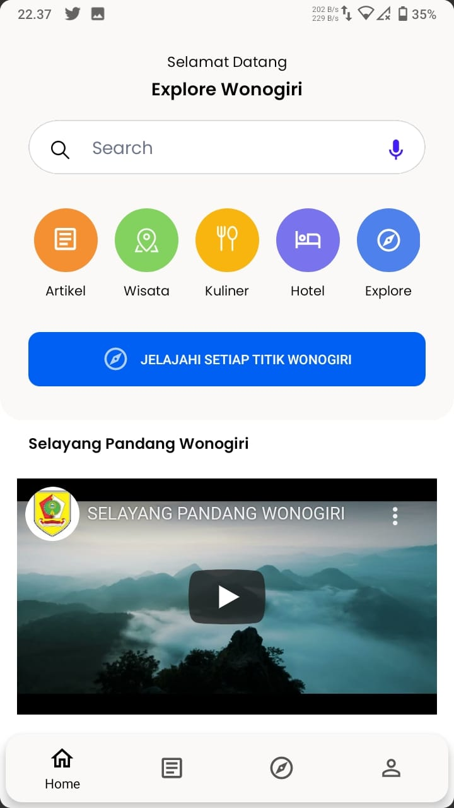
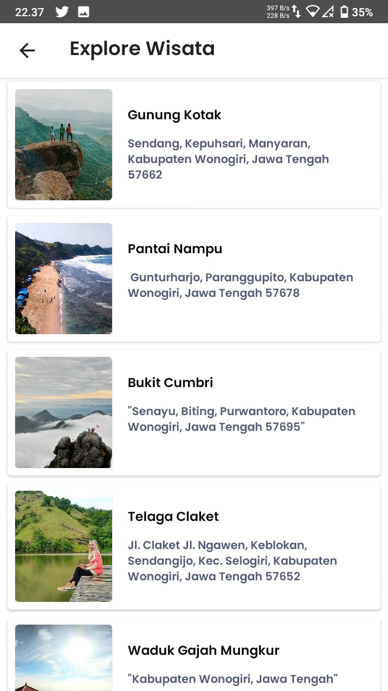
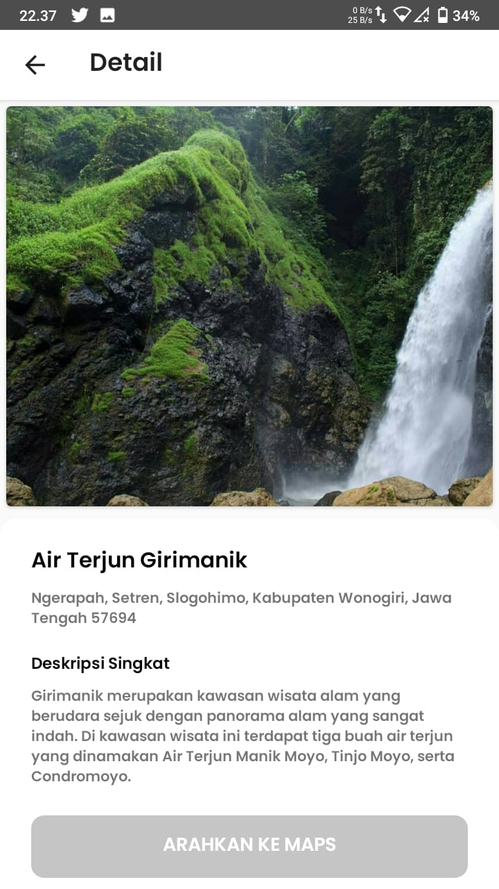
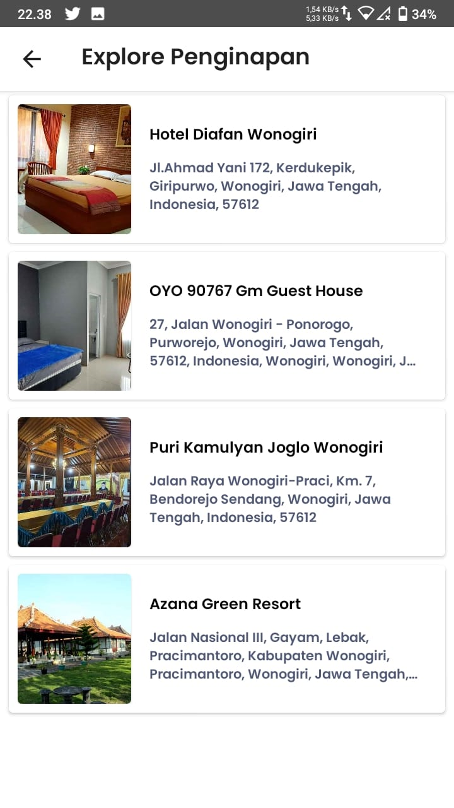
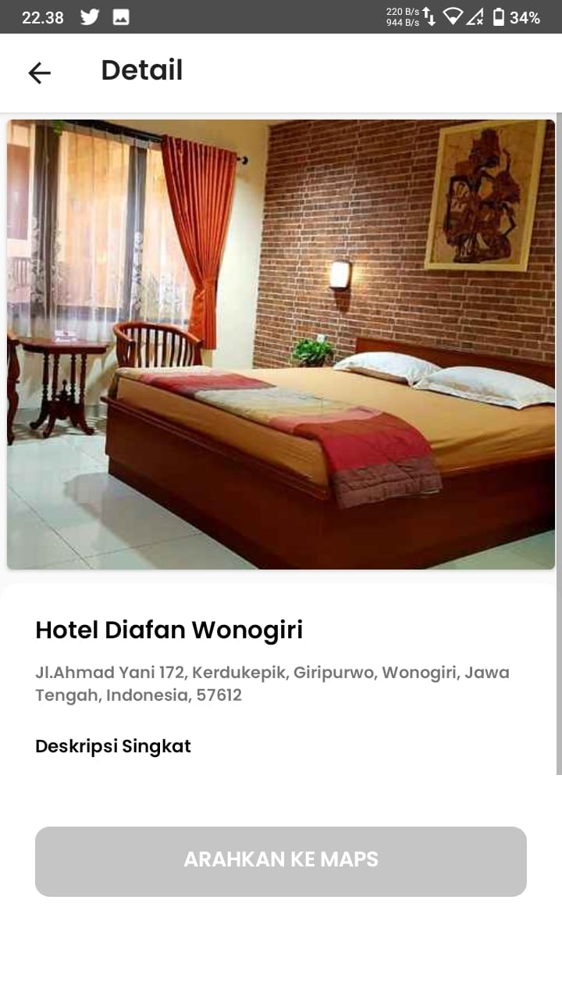
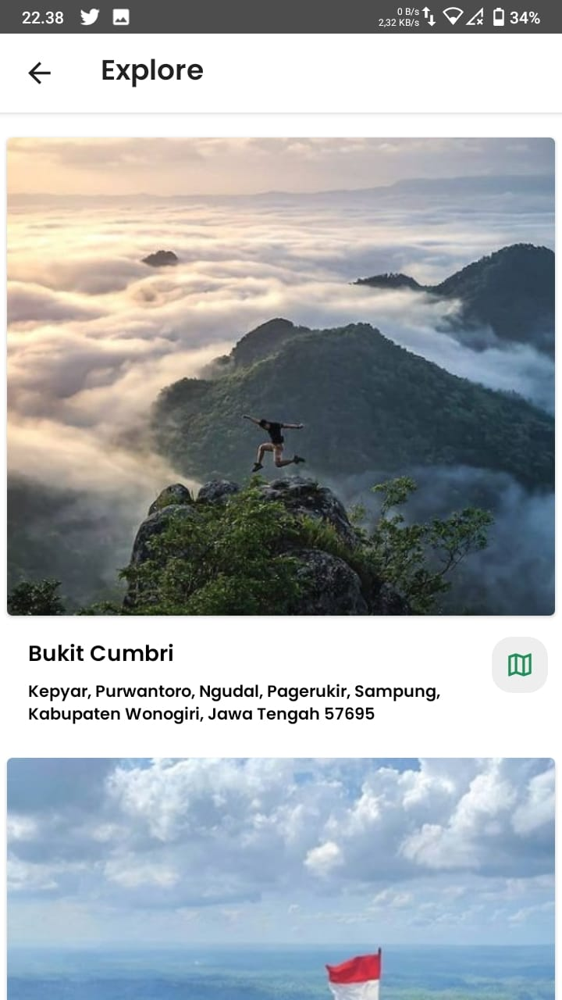
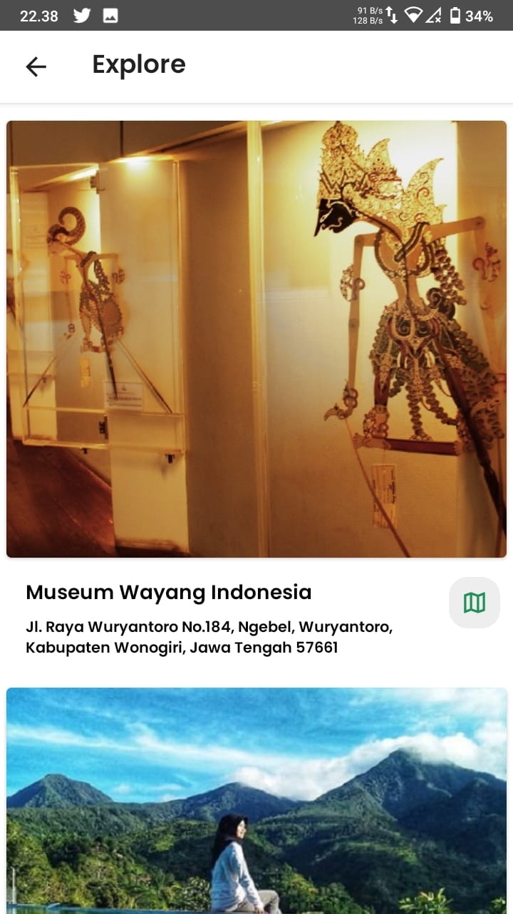

# EXPLORE WONOGIRI
Repositori ini dibuat untuk pemenuhan syarat kelulusan pada mata kuliah <b>Pemrograman Perangkat Bergerak Program Studi Informatika Universitas Janabadra Yogyakarta.</b>  

``` Untuk Mendownload File APK silahkan masuk ke Halaman Releases ```

## Demo
<h3 align="center"> Halaman Utama </h3>
<p align="center">
    
</p>

<h3 align="center"> Halaman Artikel </h3>
<p align="center">
    
    
</p>

<h3 align="center"> Halaman Wisata </h3>
<p align="center">
    
    
</p>

<h3 align="center"> Halaman Kuliner </h3>
<p align="center">
    
    
</p>

<h3 align="center"> Halaman Penginapan </h3>
<p align="center">
    
    
</p>

<h3 align="center"> Halaman Explore </h3>
<p align="center">
    
    
</p>
  
## Feature :
- Main Page
- Halaman Artikel
- Halaman Wisata
- Halaman Kuliner
- Halaman Penginapan
- Halaman Explore
- Database Menggunakan Firebase
    
## Author
Nama : <b>Muhamad Dedi Yusup</b><br>
NIM  : <b>19330015</b>
